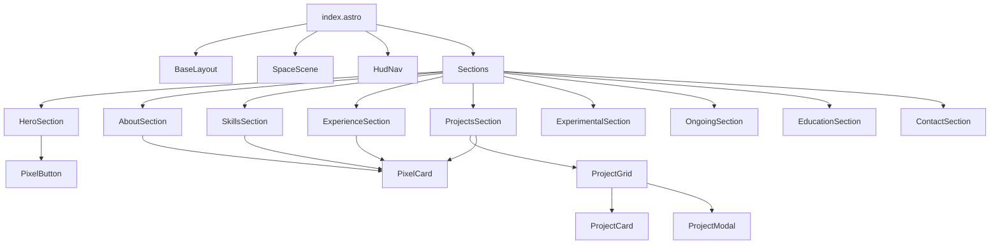
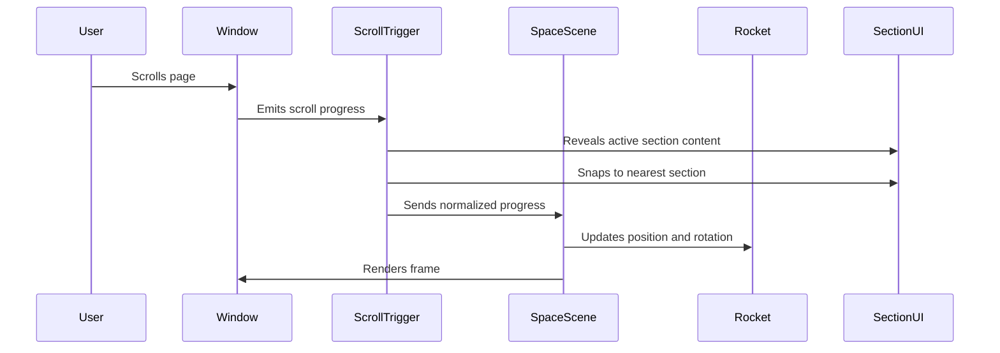

# AGENTS.md: Implementation Guide for Astro Retro Game Portfolio

## Project Intent

You are building a one-page portfolio website for Ilham Yusuf. The website should feel like a retro pixel-art space game with a rocket/spacecraft moving as the user scrolls. Ilham works as a frontend developer and also handles many fullstack responsibilities, so the portfolio should communicate both strong frontend craft and fullstack capability.

Use Astro, GSAP, and Three.js. Keep the code modular, readable, and component-based.

## Hard Rules

- Do not use emoji anywhere in the UI.
- Use icons instead of emoji.
- Use Astro as the main framework.
- Use GSAP ScrollTrigger for scroll animation.
- Use Three.js for the rocket/space scene.
- Keep the website as a single page.
- Each main section must be `min-height: 100vh`.
- Scrolling should snap or auto-move to the next section.
- Store reusable components inside `src/components`.
- Store public assets inside `public/assets`.
- Project detail must open in a popup/modal, not a separate page.
- Respect `prefers-reduced-motion`.
- Keep content readable and accessible.
- Do not add backend code unless explicitly requested.
- Do not invent external URLs for projects. Use placeholders when links are unknown.
- Do not use unclear asset licenses. Prefer CC0 assets.

## Recommended Stack

```txt
Astro
TypeScript
GSAP
GSAP ScrollTrigger
Three.js
CSS / SCSS
Icon library: astro-icon, lucide, or local SVG icons
```

## Commands

Use these commands unless the existing project already has a different package manager.

```bash
npm create astro@latest
npm install gsap three
npm install -D typescript
```

Optional icon package:

```bash
npm install astro-icon
```

If the project uses pnpm:

```bash
pnpm create astro@latest
pnpm add gsap three
pnpm add -D typescript
pnpm add astro-icon
```

## Folder Structure

Create or follow this structure:

```txt
src/
  components/
    layout/
      BaseLayout.astro
      Section.astro
      HudNav.astro
      ScrollProgress.astro
    scene/
      SpaceScene.ts
      RocketModel.ts
      Starfield.ts
      PixelParticles.ts
    sections/
      HeroSection.astro
      AboutSection.astro
      SkillsSection.astro
      ExperienceSection.astro
      ProjectsSection.astro
      ExperimentalSection.astro
      OngoingSection.astro
      EducationSection.astro
      ContactSection.astro
    portfolio/
      ProjectCard.astro
      ProjectGrid.astro
      ProjectModal.astro
      StackChip.astro
    ui/
      PixelButton.astro
      PixelCard.astro
      PixelFrame.astro
      Icon.astro
      Modal.astro
  data/
    projects.ts
    experiences.ts
    education.ts
    skills.ts
    socials.ts
  pages/
    index.astro
  scripts/
    scroll.ts
    modal.ts
  styles/
    global.css
    tokens.css
    utilities.css

public/
  assets/
    models/
      rocket.glb
    images/
      projects/
      avatar/
      backgrounds/
    icons/
    sprites/
    textures/
    fonts/
```

## Section Order

Build sections in this order:

1. HeroSection
2. AboutSection
3. SkillsSection
4. ExperienceSection
5. ProjectsSection
6. ExperimentalSection
7. OngoingSection
8. EducationSection
9. ContactSection

Each section should use the shared `Section.astro` component.

## Content Strategy

Write content in English.

Tone:

- Clear
- Professional
- Developer-focused
- Slightly game-like
- No emoji
- Avoid overly childish language

Use game labels such as:

- Start Mission
- Player Profile
- Skill Inventory
- Mission Log
- Project Archive
- Experimental Lab
- Active Quests
- Training Records
- Final Transmission

## Data Files

### `src/data/projects.ts`

Use this shape:

```ts
export type ProjectStatus = 'completed' | 'experimental' | 'ongoing';

export type ProjectCategory = 'work' | 'personal' | 'experimental' | 'ongoing';

export type Project = {
  id: string;
  title: string;
  category: ProjectCategory;
  status: ProjectStatus;
  summary: string;
  problem?: string;
  contribution?: string[];
  stack: string[];
  image?: string;
  links?: {
    label: string;
    url: string;
    icon?: string;
  }[];
};

export const projects: Project[] = [
  {
    id: 'moneyflow',
    title: 'MoneyFlow',
    category: 'personal',
    status: 'ongoing',
    summary: 'A personal finance web app for tracking accounts, income, expenses, and categories.',
    problem: 'Managing personal cash flow needs a clear dashboard and maintainable transaction flow.',
    contribution: [
      'Built the frontend architecture with reusable UI components.',
      'Designed the account, category, and transaction structure.',
      'Worked on backend API patterns using NestJS, Prisma, and PostgreSQL.'
    ],
    stack: ['Next.js', 'NestJS', 'Prisma', 'PostgreSQL', 'TypeScript'],
    image: '/assets/images/projects/moneyflow.webp',
    links: []
  },
  {
    id: 'write-mate',
    title: 'Write-Mate Add-on',
    category: 'experimental',
    status: 'experimental',
    summary: 'A browser add-on experiment for grammar, rewriting, and translation assistance near text inputs.',
    contribution: [
      'Explored browser extension UX for inline writing assistance.',
      'Planned API-key based provider integration.',
      'Designed popup and settings flow for user configuration.'
    ],
    stack: ['JavaScript', 'Browser Extension', 'API Integration'],
    image: '/assets/images/projects/write-mate.webp',
    links: []
  }
];
```

Add more projects later from the real portfolio content.

### `src/data/skills.ts`

```ts
export const skillGroups = [
  {
    title: 'Frontend',
    icon: 'code',
    skills: ['Astro', 'React', 'Next.js', 'Vue', 'Nuxt', 'TypeScript', 'SCSS', 'Tailwind']
  },
  {
    title: 'Animation & UI',
    icon: 'sparkles-icon-replacement',
    skills: ['GSAP', 'Three.js', 'Framer Motion', 'Canvas', 'CSS Animation']
  },
  {
    title: 'WordPress',
    icon: 'layout',
    skills: ['Elementor', 'WooCommerce', 'ACF', 'WPML', 'Custom Themes']
  },
  {
    title: 'Backend',
    icon: 'server',
    skills: ['Node.js', 'NestJS', 'Express', 'Prisma', 'PostgreSQL']
  },
  {
    title: 'Tools',
    icon: 'terminal',
    skills: ['Git', 'Docker', 'Linux', 'Cloudflare', 'CI/CD']
  }
];
```

Replace `sparkles-icon-replacement` with a real icon name from the selected icon library. Do not use emoji.

## Styling Requirements

Create `src/styles/tokens.css`:

```css
:root {
  --rosewater: #f5e0dc;
  --flamingo: #f2cdcd;
  --pink: #f5c2e7;
  --mauve: #cba6f7;
  --red: #f38ba8;
  --maroon: #eba0ac;
  --peach: #fab387;
  --yellow: #f9e2af;
  --green: #a6e3a1;
  --teal: #94e2d5;
  --sky: #89dceb;
  --sapphire: #74c7ec;
  --blue: #89b4fa;
  --lavender: #b4befe;
  --text: #cdd6f4;
  --subtext-1: #bac2de;
  --subtext-0: #a6adc8;
  --overlay-2: #9399b2;
  --overlay-1: #7f849c;
  --overlay-0: #6c7086;
  --surface-2: #585b70;
  --surface-1: #45475a;
  --surface-0: #313244;
  --base: #1e1e2e;
  --mantle: #181825;
  --crust: #11111b;

  --font-heading: 'PixelHeading', system-ui, sans-serif;
  --font-body: Inter, ui-sans-serif, system-ui, sans-serif;
  --font-mono: 'JetBrains Mono', ui-monospace, monospace;

  --container-width: 1120px;
  --section-padding: clamp(1.25rem, 4vw, 4rem);
}
```

Create `src/styles/global.css`:

```css
@import './tokens.css';

* {
  box-sizing: border-box;
}

html {
  color-scheme: dark;
  scroll-behavior: smooth;
}

body {
  margin: 0;
  font-family: var(--font-body);
  background: var(--crust);
  color: var(--text);
  overflow-x: hidden;
}

button,
a {
  font: inherit;
}

button {
  cursor: pointer;
}

img,
svg,
canvas {
  max-width: 100%;
}

.main-scroll {
  scroll-snap-type: y mandatory;
}

@media (max-width: 768px) {
  .main-scroll {
    scroll-snap-type: none;
  }
}

@media (prefers-reduced-motion: reduce) {
  *,
  *::before,
  *::after {
    animation-duration: 0.01ms !important;
    animation-iteration-count: 1 !important;
    scroll-behavior: auto !important;
    transition-duration: 0.01ms !important;
  }
}
```

## Shared Section Component

Create `src/components/layout/Section.astro`:

```astro
---
const { id, label, class: className = '' } = Astro.props;
---

<section id={id} class={`section ${className}`} data-section={id} aria-label={label}>
  <div class="section__inner">
    <slot />
  </div>
</section>

<style>
  .section {
    min-height: 100vh;
    position: relative;
    display: grid;
    place-items: center;
    overflow: hidden;
    scroll-snap-align: start;
    padding: var(--section-padding);
  }

  .section__inner {
    width: min(100%, var(--container-width));
    margin-inline: auto;
    position: relative;
    z-index: 2;
  }
</style>
```

## GSAP Scroll Setup

Create `src/scripts/scroll.ts`:

```ts
import gsap from 'gsap';
import { ScrollTrigger } from 'gsap/ScrollTrigger';

gsap.registerPlugin(ScrollTrigger);

const prefersReducedMotion = window.matchMedia('(prefers-reduced-motion: reduce)').matches;

export function initScrollAnimations() {
  if (prefersReducedMotion) return;

  const sections = gsap.utils.toArray<HTMLElement>('[data-section]');

  sections.forEach((section) => {
    const revealItems = section.querySelectorAll('[data-reveal]');

    gsap.fromTo(
      revealItems,
      { y: 32, opacity: 0 },
      {
        y: 0,
        opacity: 1,
        duration: 0.6,
        stagger: 0.08,
        ease: 'power3.out',
        scrollTrigger: {
          trigger: section,
          start: 'top 70%',
          end: 'bottom 30%',
          toggleActions: 'play none none reverse'
        }
      }
    );
  });

  ScrollTrigger.create({
    trigger: document.body,
    start: 'top top',
    end: 'bottom bottom',
    snap: {
      snapTo: 1 / Math.max(sections.length - 1, 1),
      duration: 0.35,
      ease: 'power2.out'
    }
  });
}
```

Import it in `src/pages/index.astro` using a client-side script:

```astro
<script>
  import { initScrollAnimations } from '../scripts/scroll';
  initScrollAnimations();
</script>
```

## Three.js Scene Guidance

Create a Three.js scene that attaches to a fixed canvas layer behind or beside content.

Main responsibilities:

- Load `/assets/models/rocket.glb`.
- Render starfield background.
- Update rocket position based on scroll progress.
- Reduce particle count on mobile.
- Disable animation if `prefers-reduced-motion` is enabled.

Use `GLTFLoader` for the `.glb` model.

Suggested behavior:

```ts
const scrollProgress = window.scrollY / (document.body.scrollHeight - window.innerHeight);
rocket.position.y = gsap.utils.interpolate(2, -8, scrollProgress);
rocket.position.x = Math.sin(scrollProgress * Math.PI * 4) * 1.25;
rocket.rotation.z = Math.sin(scrollProgress * Math.PI * 3) * 0.2;
```

Do not make this code final until the actual scene size and camera are known.

## Asset Sources

Preferred asset sources:

1. Kenney Space Kit
   - Good for CC0 space-themed assets.
   - Recommended for rocket/ship/planet assets.

2. Quaternius
   - Good for CC0 low-poly game assets.
   - Recommended for low-poly spaceships or environment props.

3. Poly Pizza
   - Useful for free low-poly models.
   - Must verify individual model license before using.

4. Unsplash
   - Useful for reference/background images.
   - Prefer not to use photorealistic images as main visual style.

Asset implementation rule:

- Download chosen model manually.
- Optimize it.
- Rename it to `rocket.glb`.
- Store it at `public/assets/models/rocket.glb`.
- Add source/license notes in `public/assets/ASSET_LICENSES.md`.

Create `public/assets/ASSET_LICENSES.md`:

```md
# Asset Licenses

## rocket.glb

- Source: TODO
- Author: TODO
- License: TODO
- Download date: TODO
- Notes: Verify license before production release.
```

## Modal Requirements

Create reusable modal component.

Behavior:

- Opens when project card is clicked.
- Closes when close button is clicked.
- Closes on Escape.
- Focus returns to clicked card after close.
- Background scroll should be disabled while modal is open.
- Use `role="dialog"` and `aria-modal="true"`.

Avoid hover-only interactions.

## Project Card Requirements

Each card should show:

- Title
- Category
- Status
- Summary
- Stack chips
- View Details button

Use a real `button` for opening modal.

## HUD Navigation Requirements

The HUD navigation should show:

- Current section
- Section list with icons
- Scroll progress

Recommended labels:

```ts
const navItems = [
  { id: 'hero', label: 'Start', icon: 'rocket' },
  { id: 'about', label: 'Profile', icon: 'user' },
  { id: 'skills', label: 'Inventory', icon: 'code' },
  { id: 'experience', label: 'Log', icon: 'briefcase' },
  { id: 'projects', label: 'Archive', icon: 'folder' },
  { id: 'experimental', label: 'Lab', icon: 'flask' },
  { id: 'ongoing', label: 'Quests', icon: 'activity' },
  { id: 'education', label: 'Training', icon: 'graduation-cap' },
  { id: 'contact', label: 'Contact', icon: 'send' }
];
```

## Mermaid: Component Dependency Diagram



## Mermaid: Scroll Scene Flow



## Build Order

Follow this order:

1. Create token and global styles.
2. Create `BaseLayout.astro` and `Section.astro`.
3. Create static data files.
4. Build all sections without animation.
5. Build project cards and modal.
6. Add HUD navigation.
7. Add GSAP reveal animation.
8. Add GSAP snap behavior.
9. Add Three.js scene with placeholder cube or simple geometry.
10. Replace placeholder with `rocket.glb`.
11. Add particle/starfield polish.
12. Add responsive improvements.
13. Add reduced motion support.
14. Run performance and accessibility checks.

## Quality Checklist

Before finishing, verify:

- No emoji appears in UI text.
- All main sections are 100vh.
- Scroll snapping works on desktop.
- Mobile scrolling is not frustrating.
- Project modal works with keyboard.
- Rocket scene does not cover important content.
- Assets are stored in `public/assets`.
- Components are inside `src/components`.
- Data is separated inside `src/data`.
- Colors use CSS variables from the supplied palette.
- Reduced motion mode works.
- Lighthouse performance is acceptable.
- No external asset is used without license notes.

## Suggested First Prompt to Continue Implementation

Use this prompt when asking AGENTS or another coding agent to start the build:

```txt
Build the foundation for my Astro portfolio redesign based on PRD.md, DESIGN.md, and AGENTS.md.

Start with:
1. Astro folder structure
2. global CSS tokens
3. BaseLayout
4. Section component
5. index.astro with all 9 sections
6. placeholder content from data files
7. pixel button/card components

Do not add Three.js yet. Keep the first implementation clean and responsive. Do not use emoji. Use icons only.
```


## Reference Usage

Before editing visual implementation, inspect the `/references` folder.

The references define the desired quality and mood. Do not copy them directly.

Important interpretation:

- The site should be professional and elegant first.
- Retro pixel/game influence should be subtle.
- The current implementation is too colorful, too ornamental, and too childish.
- Do not add more decorative game UI.
- Remove visual noise before adding new effects.

## Current Fix Priority

Work in this order:

1. Update visual system rules.
2. Remove excessive ornaments and colors.
3. Neutralize card borders.
4. Replace skill progress bars with grouped skill cards.
5. Fix GSAP section snapping.
6. Replace toy rocket with Space Impact-inspired spacecraft.
7. Reduce whitespace section by section.
8. Polish responsive layout.

Do not attempt all tasks in one pass.
